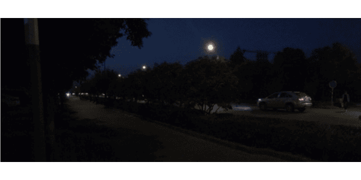
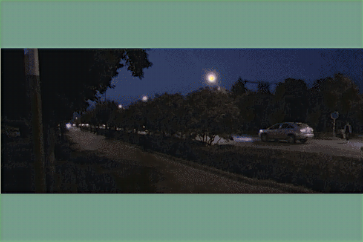
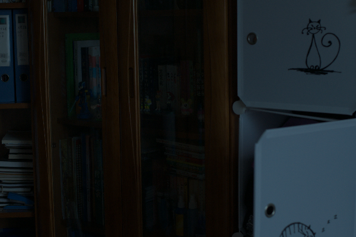
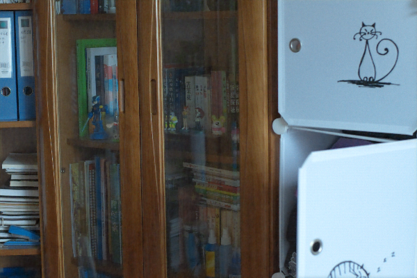

# 🌙 Retinexformer: Low-Light Image Enhancement

  
  
   
  <em>Top: Low-light input | Bottom: Retinexformer enhanced output</em>

  
  
   
  <em>Additional enhancement examples using Retinexformer</em>

---

## 🧠 Abstract

Low-light image enhancement is a key problem in computer vision that aims to improve the visibility, brightness, and color quality of images captured in dark environments. Traditional enhancement methods based on the Retinex theory struggle with noise, artifacts, and color distortion, while most deep learning approaches rely on complex multi-stage pipelines that are difficult to train.  

To address these issues, this project presents **Retinexformer**, a **one-stage Retinex-based Transformer** model for efficient and effective low-light image enhancement.  

The proposed model introduces a **One-stage Retinex-based Framework (ORF)** that jointly estimates illumination and restores corrupted regions in a single end-to-end process. An **Illumination-Guided Transformer (IGT)** is designed as the core component, which uses illumination information to guide the attention mechanism, enabling the model to capture long-range dependencies and adaptively enhance areas with different lighting conditions.  

Experimental results on multiple benchmark datasets demonstrate that **Retinexformer** significantly outperforms state-of-the-art CNN-based and Transformer-based enhancement methods in both quantitative measures and visual quality. In addition, user studies and object detection tests on enhanced images confirm its practical value for real-world low-light photography and vision applications.
